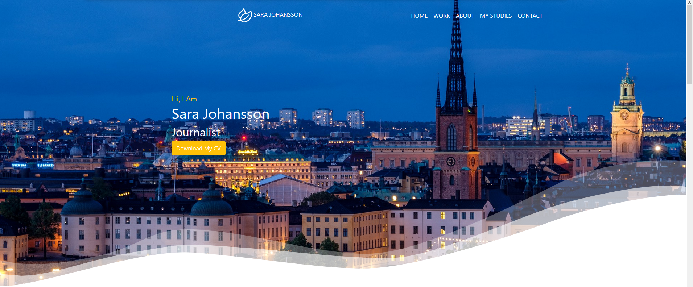
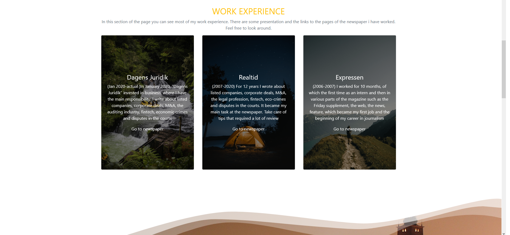
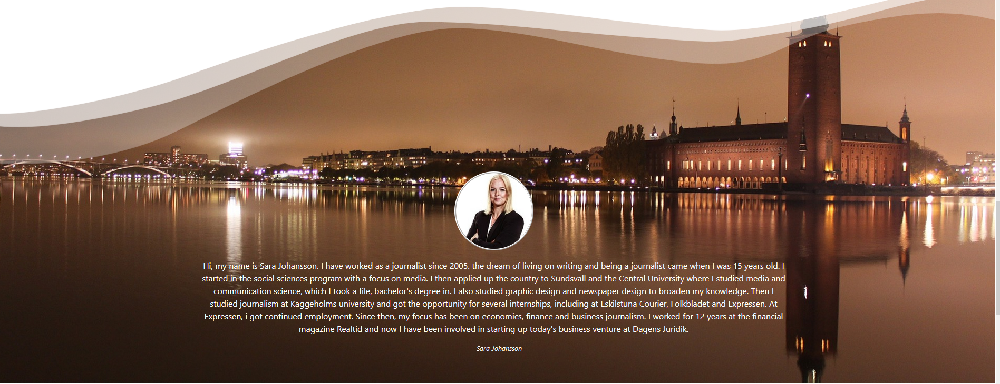
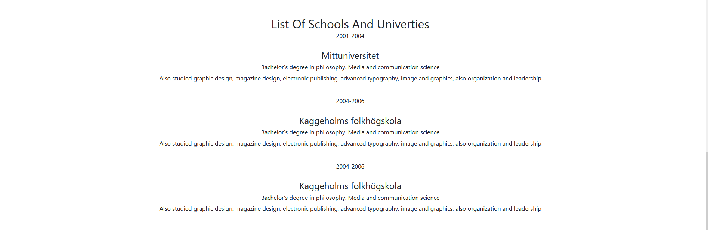
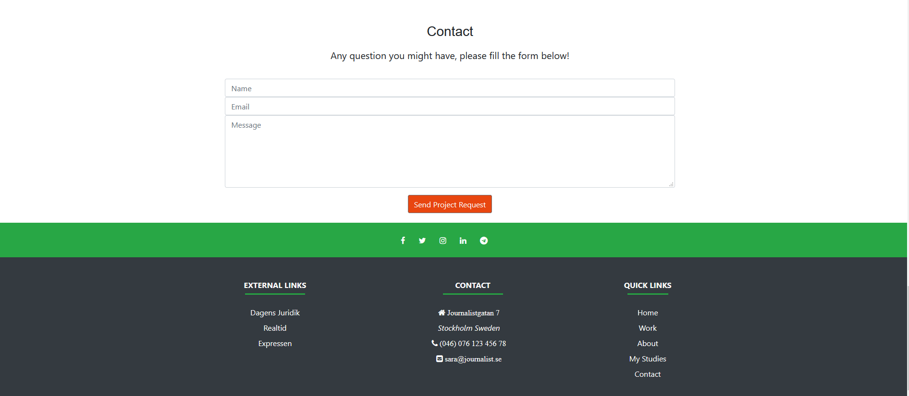

# __A journalist Portfolio__
The project is based on the need of a journalist to have a portfolio were as well as employeers and people who are not in the
media business can take a look and contact the person in question.The information in this webpapage
its taken from a real person who is a journalist in Sweden. The picture of the journalist and the information in the 
"work"and "educational" area are real. The information regarding the "Cv" and personal info are ficticious.

# __UX__

__The purpose of this portfolio is to :__

+ Get possible employees to be intrested in the person in question
+ Reach out not only to companies but also people who'd like an interview
+ Give the possibility to the journalist not only to be contacted but also
for people are just curious in reading who this journalist is.

# __Features__

My project is a portfolio one page, and its is divided in four section. The page consist in a navegation bar, witch make it possible to move 
to the different parts of the page. a home, work, my studies and a contact section. Also a footer with external and social links.

### Let's take a look at the different parts of the page

+ [Portfolio](https://pretro.github.io/PortfolioMileStone/) (a link to the portoflio page)

+ The home section is where you can download the CV as well as navegate through the menu. Have in mind that
the CV is ficticious and taken from the course "miniproject" from Code Institute.  

+ In the work experiece section you can see the journalist work history, and go to the newspaper realted to her work

+ The About section is a short description of the journalists profile.

+ In the studies section, shows the information of theuniversities where the person in question study.
The infortion shown in this section is real.

+ The contact and footer are divided in two. The contact is a contact form where anyone who is interested can send 
a messageto the journalist regarding any question.

+ The footbar holds the social links, external links, a menu where the user can navegate back to each section
and the journalist personal information. (As well as in the CV,the personal information shown here is also not real, only the name of the journalist in the mail)

# Technologies used

For the making of this project, the following technologies has been used.

+ [Gitpod](https://www.gitpod.io/) 

    Gitpod is used as the enviroment program were the page was made.

+ [Github](https://github.com/) 

    Github is used as the development platform, you can upload your code and make repositories. This platform, gives other users
    the opportunity to see your repositories if made as open source code.

+ [HTML](https://www.w3schools.com/)
    
    HTML is the language use to make websites.Since it is the standard markup languages for webpages.

+ [CSS](https://www.w3schools.com/css/default.asp)

    CSS is the language used to style the pages made in HTML. 

+ [W3C Valitor HTML](https://validator.w3.org/)

    W3C validator is the tool we use to check the markup validity in HTML.

+ [WC Valitor CSS](https://jigsaw.w3.org/css-validator/#validate_by_input)

    As mentioned above, this tool is use to check for errors in the css code.

+ [Fontawesome]
+ Googlefonts
+ Youtube
+ Bootstrap 4

# Credits

## __Content__

### __Media__

__The photos use in this project were taken from__  

+ Sara Johansson
+ [Pixabay](https://pixabay.com/sv/) 

__For the social media icons__ 

+ [Fontawesome](https://fontawesome.com/)

__For the font i use__

+ [Googlefonts](https://fonts.google.com/) 

## __Acknowledgements__

+ I want to start thanking Sara Johansson for helping with this project and giving kindly information about her carrer and study background.
+ Also want to thank Christian Mossberg, a friend and personal mentor for helping me with advise during the course of this project.
+ To my mentor Antonio Rodriguez who had the patience to guide me whenever i did not understand a part of the project.
+ To "Granos de cafe". where i got my inspiration from to the making of the page.
+ To the Code institite tutorial were i also got ideas from to make my project.

 

